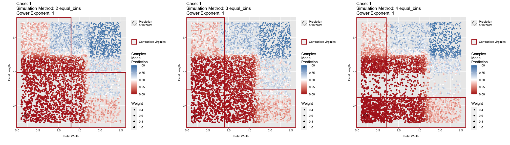

# limeaid 

🚧 under construction 🚧

limeaid is an R package for assessing explanations created using the R
package [lime](https://lime.data-imaginist.com/).

``` r
# Installation instructions 
devtools::install_github("goodekat/limeaid")
```

``` r
library(cowplot)
library(lime)
library(limeaid)
library(randomForest)

# Iris training and testing
iris_test <- iris[1:5, 1:4]
iris_train <- iris[-(1:5), 1:4]
iris_lab <- iris[[5]][-(1:5)]

# Fit a random forest model to the iris training data
rf <- randomForest(Species ~ .,
                   data = cbind(iris_train, 
                                Species = iris_lab))

# Run apply_lime on the iris data
lime_applied <- apply_lime(train = iris_train,
                           test = iris_test,
                           model = rf,
                           label = "virginica",
                           n_features = 2,
                           sim_method = c('quantile_bins',
                                          'equal_bins',
                                          'kernel_density'),
                           nbins = 2:4, 
                           gower_pow = c(1, 5),
                           return_perms = TRUE)

# Extract the explanations from the apply_lime output
explanations <- lime_applied$explain
```

``` r
# Create a heatmap of the features chosen
feature_heatmap(explanations)
```

<!-- -->

``` r
# Create a plot of metrics for comparing the lime implementations
metric_plot(explanations)
```

<!-- -->

``` r
# Plots of several explanations of interest (2-4 quantile bins)
plot_grid(eoi_plot(explanations[1:2,]),
          eoi_plot(explanations[11:12,]),
          eoi_plot(explanations[21:22,]),
          nrow = 1)
```

<!-- -->

``` r
# Plots of several explanations of interest (2-4 equal bins)
plot_grid(eoi_plot(explanations[31:32,]),
          eoi_plot(explanations[41:42,]),
          eoi_plot(explanations[51:52,]),
          nrow = 1)
```

<!-- -->

``` r
# Plots of an explanation of interest (kernel density)
eoi_plot(explanations[121:122,])
```

<!-- -->
